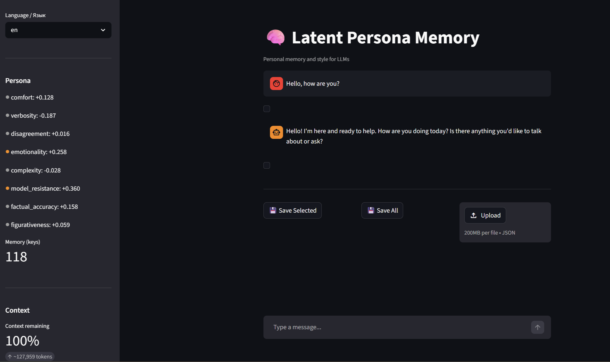
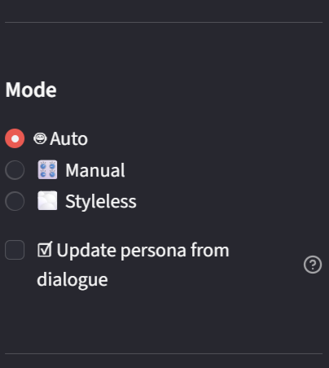
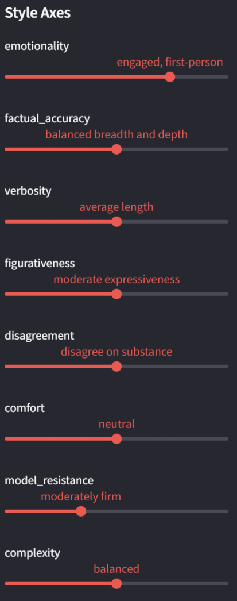
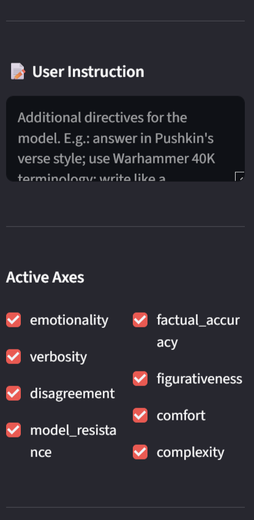
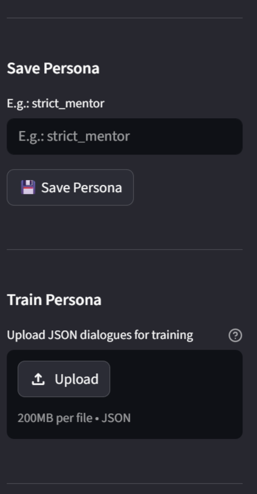
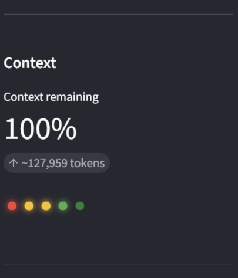
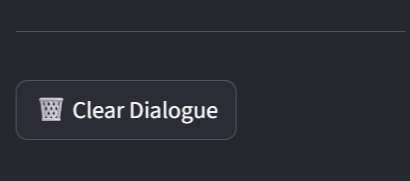

# Latent Persona Memory

[](https://opensource.org/licenses/MIT)
[](https://www.python.org/downloads/release/python-3110/)
[](https://www.docker.com/)

> An LLM wrapper that gives your assistant a persistent persona — carrying conversation style and context across dialogs. The persona is shaped not by what the model knows, but by how the user writes: brevity, emotional tone, dryness, and more. Memory is fuzzy — it pulls only the gist from past conversations, not the raw text.

## 🖥️ Interface

### Main view
Key controls are on the sidebar (scrollable).


### Mode panel


### Manual axis sliders


### Additional system prompt settings


### Persona file controls


### Context window remaining indicator


### Reset current dialogue



## ✨ Features

- **Streaming style analysis:** Automatic detection of 20 linguistic surface features
- **Semantic memory:** Retains conversation context without storing raw facts or transcripts
- **Adaptive behavior:** The model adjusts to your communication style along 8 independent axes
- **Fully containerized:** One-click Docker launch, all dependencies included
- **Fine-grained control:** Manual tuning of every persona parameter through the UI, with support for custom user instructions as an additional system prompt section
- **Bilingual:** Full Russian and English support — UI, marker detection, and prompts

## 🏗️ Architecture

The project runs four parallel analysis streams that converge in the Persona Core to produce the final system prompt for the LLM. All components are bilingual — stop-word detection, style markers, and prompts work in both Russian and English.

| Stream | Purpose | Method |
|--------|---------|--------|
| **A — Fuzzy Memory** | Semantic cloud of past dialogues | E5-large + KeyBERT + associative memory |
| **B — Surface Style** | Linguistic surface features | spaCy + pymorphy3 (20 features) |
| **C1 — Explicit** | Direct user instructions | Prototype embeddings, 8 axes |
| **C2 — Implicit** | Reactions to model responses | Follow-up message analysis |
| **Fusion** | Merging the streams | Adaptive weights, 8 axes |

### Persona axes

| Axis | Range | Description |
|------|-------|-------------|
| `emotionality` | –1 (dry) ↔ +1 (empathetic) | Level of emotional engagement |
| `factual_accuracy` | –1 (broadest possible view) ↔ +1 (deep dive into the most accepted version) | Breadth of perspectives vs. depth of consensus |
| `verbosity` | –1 (concise) ↔ +1 (detailed) | Response length and level of detail |
| `figurativeness` | –1 (plain speech) ↔ +1 (literary, figurative) | Richness and complexity of expressive language |
| `disagreement` | –1 (agreeable) ↔ +1 (debate-oriented) | Willingness to challenge and object |
| `comfort` | –1 (overly familiar) ↔ +1 (formal politeness) | Social distance and formality |
| `model_resistance` | 0 (yield to user pressure) ↔ +1 (hold the line) | Resilience to user pressure and role imposition |
| `complexity` | –1 (simple) ↔ +1 (terminology-heavy) | Technical complexity of language |

## 🚀 Quick start

### Prerequisites

- [Docker](https://docs.docker.com/get-docker/) installed on your machine
- Yandex Cloud API key with access to DeepSeek

### Option 1: Pull from GitHub Container Registry

```bash
# Pull the latest image
docker pull ghcr.io/dmitrii-devetiarov/persona-project:latest

# Create a project directory and navigate into it
mkdir persona-memory && cd persona-memory

# Set up environment
cp .env.example .env
# Edit .env with your YANDEX_API_KEY and YANDEX_FOLDER_ID

# Create empty data directory for persona persistence
mkdir -p data

# Start the application
docker compose up
```
Open http://localhost:8501 in your browser.

### Option 2: Build from source

```bash
# Clone the repository
git clone https://github.com/Dmitrii-Devetiarov/Persona_Project.git
cd Persona_Project

# Set up environment
cp .env.example .env
# Edit .env with your YANDEX_API_KEY and YANDEX_FOLDER_ID

# Build and run
docker compose up
```
Open http://localhost:8501 in your browser.

## ⚙️ Configuration

| Variable | Description |
|----------|-------------|
| `YANDEX_API_KEY` | Yandex Cloud service account API key |
| `YANDEX_FOLDER_ID` | Yandex Cloud folder ID |

## 🗺️ Roadmap

- [ ] Automated A/B testing for persona shift validation
- [ ] FastAPI integration for network access
- [ ] Port to ONNX Runtime to reduce image size
- [ ] Unit test coverage for critical components
- [ ] Expand localization (add new languages)

## 📝 License

This project is licensed under the MIT License. See the [LICENSE](LICENSE) file for details.

### Third-party licenses

This project uses the following open-source libraries, distributed under their respective licenses:

| Library | License |
|---------|---------|
| **sentence-transformers** (Nils Reimers) | [Apache 2.0](https://github.com/UKPLab/sentence-transformers/blob/master/LICENSE) |
| **Streamlit** | [Apache 2.0](https://github.com/streamlit/streamlit/blob/develop/LICENSE) |
| **OpenAI Python SDK** | [Apache 2.0](https://github.com/openai/openai-python/blob/master/LICENSE) |
| **KeyBERT**, **spaCy**, **pymorphy3**, **tiktoken** | MIT |
| **scikit-learn**, **numpy** | BSD 3-Clause |

Full license texts for **Apache 2.0** components are provided in the [`third-party/`](third-party/) directory.

## 🙏 Acknowledgements

Special thanks to the creators and maintainers of **sentence-transformers**, **spaCy**, **KeyBERT**, and **Streamlit** — your work made this project possible.

Grateful to **Yandex Cloud** for providing access to DeepSeek.

And a sincere thank you to the entire open-source community and all contributors to the libraries this project depends on — the ones listed above and the many others not named but relied upon.